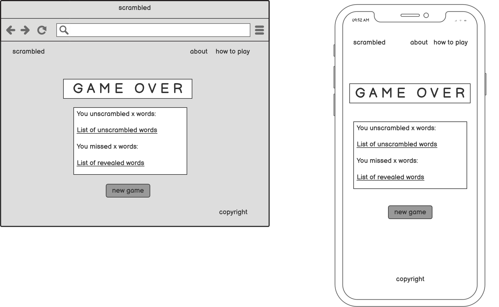
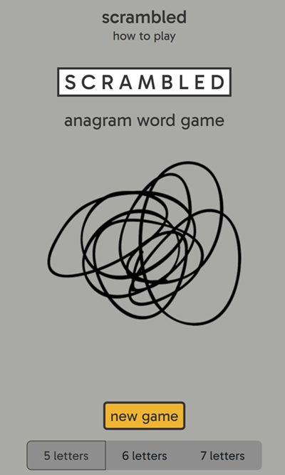
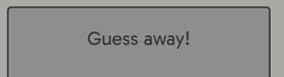
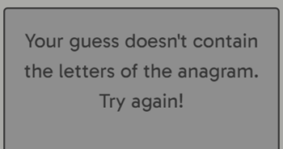
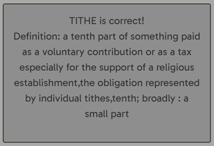
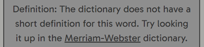
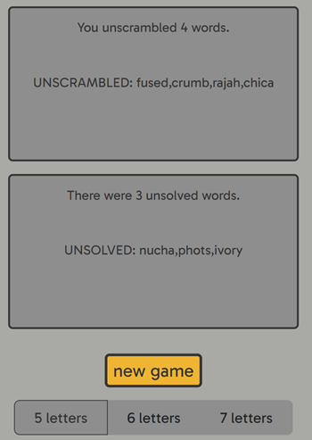

# **scrambled**

**scrambled** is an anagram word game in which the player attempts to solve as many anagrams as they can. The player can choose a 5-, 6-, or 7-letter word game. The player has three lives; they lose a life if they make an incorrect guess or opt to reveal the word. A correct guess allows them to proceed to the next word. The game ends when the three lives are up or when the player decides. The player is then given a summary of the game and an invitation to start a new game.

Have a go! [**scrambled**](https://mksambell.github.io/scrambled/)

## Contents
1. [**User Experience UX**](#1-user-experience-ux)
    - [Strategy](#strategy)
	- [User Stories](#user-stories)
    - [Site Structure](#site-structure)
    - [Wireframes](#wireframes)
    - [Surface](#surface)
2. [**Features**](#2-features)
	- [Existing Features](#existing-features)
		- [Title and instructions](#title-and-instructions)
    - [Landing page](#landing-page)
    - [Gameplay layout](#gameplay-layout)
    - [User input section](#user-input-section)
    - [Shuffle function](#shuffle-function)
    - [Random word selection](#random-word-selection)
    - [Dictionary API](#dictionary-api)
    - [Feedback section](#feedback-section)
    - [Game over display](#game-over-display)
    - [Game summary](#game-summary)
    - [Footer](#footer)
	- [Future Features](#future-features)
3. [**Technology used**](#3-technology-used)
4. [**Testing**](#4-testing)
5. [**Deployment**](#5-deployment)
6. [**Credits**](#6-credits)
7. [**Acknowledgements**](#7-acknowledgements)

# 1. User Experience UX

## Strategy

The aim is to provide a fun game in the style of Countdown's Conundrum round, in which players attempt to solve an anagram. The game is intended to be light-hearted and user-friendly, but also be informative and present a degree of challenge. Players will be able to play a casual game, and dedicated wordgame enthusiasts will be able to play multiple times to hone their anagram-solving skills. 

In the conundrum round, players are given 30-seconds to solve a 9-letter anagram; the aim is for the player to guess the anagram before their opponent. In **scrambled** the aim is for the user to solve as many anagrams as they can, so the timer element is replaced with a system of lives. This allows the user more thinking time and makes the game more open-ended: players could potentially play indefinitely, as long as they keep correctly guessing the anagrams. The limited number of lives keeps a degree of challenge - players must be careful with their guesses.

The conundrum round exclusively features 9-letter anagrams. To make **scrambled** accessible to a wide range of users, the user will be able to select the length of anagram they want to solve, either 5-, 6-, or 7-letter words. There will also be the option to shuffle the order of the letters to provide a fresh perspective on the anagram. The player can to do this as many times as they like.

In Countdown, the 'Dictionary Corner' feature gives information about discovered words. **scrambled** will also feature a short definition of words, once they have been unscrambled or revealed. This adds an informative/educational aspect to the game; users can develop their vocabulary while playing the game.

[Back to contents](#contents)

## User stories

As a player of the game, I want:
1. To find out how to play the game
2. To navigate easily around the game
3. To have clear feedback on my guesses
4. To clearly see how many lives I have remaining
5. To be able to shuffle the letters of the anagram
6. To be able to end the game at any stage
7. To have helpful feedback if I make an input error
8. To be protected from accidentally ending the game
9. To receive a summary of each game
10. To have a running total of the words I have solved
11. To know more about each unscrambled word

[Back to contents](#contents)

## Site Structure

The site is structured on one page which changes according to user interactions:

[*Landing page*](index.html)
- The landing page contains the title, a brief description, links to instructions and information about the game, and buttons to select the word lengths and to start a new game.

*During gameplay*
- The main gameplay page
- Displays the anagram
- Contains user interaction panel - guess input, buttons for shuffle, reveal/next word, enter and end game
- Feedback panel - displays messages to user, including information about unscrambled words and error messages
- Contains end game button for users to stop game at any time

*Game over*
- Displays a summary of the current game
- User panel displays list of unscrambled words
- Feedback panel displays list of unsolved words
- Contains buttons to select word length and start another new game

[Back to contents](#contents)

## Wireframes

The following wireframes were created in [Balsamiq](https://balsamiq.com/) and include responsive design ideas for Laptop, Tablet and Mobile devices. 

**Home page**

  

**Gameplay page**

**Game over page**

[Back to contents](#contents)

## Design choices

**Typography**

Gabarito font, from Google Fonts, is used throughout. It's a fun, bold font which gives a lighthearted feel, and it also scales well to display the main anagram in capitals. The font defaults to sans serif.

**Icons**

Heart icons from [FontAwesome](https://fontawesome.com/) are used to show the number of lives remaining (solid and outlines).

[Back to contents](#contents)

**Colours**

The colour scheme was chosen to give a high contrast and clean effect with splashes of colour for icons and buttons.

**Styling**

- The aim is to make the page as intuitive to use as possible, and to keep the main gameplay buttons and features clearly organised. On tablet and laptop viewports, user input features will be kept on the left of the screen and feedback will be on the right. On mobile devices, the user input and buttons will be just below the displayed word, and feedback below.

[Back to contents](#contents)

## 2. Features

The site is intended to be easy to navigate around and intuitive to use. Common layout, terminology and icons are used to help the user find their way around easily, and high contrast between font and background has been used to make the text immediately clear.

## Existing Features

### Title and instructions

- The title logo is placed at the top left corner of tablet and laptop screens, and in the centre of mobile screens
  - This is a link to the landing page; users are asked to confirm navigation as it may end an active game
- Instructions for how to play are placed in the top right corner on tablet and laptop, and centrally underneath the title
  - Clicking on 'how to play' brings up a modal with instructions

[Back to contents](#contents)

### Landing page

- The main anagram display contains the title on loading - this changes throughout but the display box remains in place
- A brief description and logo image is placed below the anagram display
  - The same logo image is used as a favicon
- New game button is the only coloured element to draw user's attention
- A button group allows users to select the length of word to be used in the new game. The default is set to 5-letter words

[Back to contents](#contents)

### Gameplay layout

- When the user clicks on new game, the html is changed to display the gameplay layout
- The new game button becomes a start game button
- The options for word-length are hidden
- When the user hits start game, the title in the anagram display changes to the first anagram of the game
  - The start game button becomes the end game button which when clicked asks the user for confirmation to end current game

### User input section

- Situated on the left-hand side in tablet and laptop viewports, and centrally in mobile
- Contains the majority of the interactive elements for the user:
  - input box, buttons for shuffle, reveal/next, and enter
- Displays number of remaining lives as heart icons (filled or outline), and the current score
- The user can enter their guess by clicking enter or hitting the 'Enter' key
- If the user clicks 'reveal' a confirmation is required, as proceeding loses a life

### Shuffle function

- The user can click the shuffle button as many times as desired without penalty
- The function uses an algorithm to randomly reorder the letters of the word 
  - It checks that the reorder does not present the actual word before displaying

### Random word selection

- When the user clicks 'start game' or 'next' during a game, the game calls a Random Word API to select the next word
- If the API call fails, the game selects a word from the locally stored wordlists; the user is always able to play

### Dictionary API

- When the user successfully solves a word, or chooses to reveal a word, a short definition of the word is displayed in the feedback section.
- The Merriam-Webster Collegiate Dictionary API is called for this information.
- See [Feedback section](#feedback-section) below for what is displayed in different scenarios.

### Feedback section

- Situated on the right-hand side in tablet and laptop viewports, and centrally in mobile, underneath the user input section
- Displays all messages to the user:
  - When the user clicks 'start game' button or 'next', the game informs the user that an anagram is being generated. A loading gif displays while the APIs are called and the word is shuffled

- When the anagram is displayed in the display, the user is invited to 'Guess away!'

- If the user makes an incorrect guess, or an invalid guess, they are given relevant feedback

- If the user guesses correctly, the correct word is confirmed and a short definition is given

- If the user chooses to reveal the word, the correct word is displayed with the definition
- If the dictionary API does not return a short definition, this is communicated to the user, along with a link to the dictionary website, in case the user wants to search up the word manually.

### Game over display

- Displays when the user opts to end the game, or when they run out of lives
- 'Game over' shows in the anagram display
- The final word, if not already revealed, displays in the feedback section
- The number of lives is reduced to zero
- The 'end game' button becomes 'game summary'

### Game summary

- Gives a summary of the game just ended
- The user input section shows a list of the successfully unscrambled words
- The feedback section shows a list of the unsolved words
- The 'game summmary' button changes to 'new game' and the options to select word-length are shown

### Footer

- Contains a link to an About modal and a copyright
- Displays in the corners in larger screens, and stacked centrally on mobile

[Back to contents](#contents)

## Future features

- Hint function
  - Users get three hints to use throughout a game. A hint could reveal one or two of the letters of the answer, randomly selected, or perhaps always give the first letter.
- Option for timed game
  - For users who want an extra degree of challenge, and an experience that more closely matches the Countdown conundrum, a timed game could be offered. If users can't solve the anagram in the time given, then a life is docked.
- Option for a limited number of words
  - It may enhance user experience if each game has a limited number of words to solve. For example, if the aim is to solve just ten anagrams, users may be more motivated to keep playing, and to play again, to try to complete the game. 

[Back to contents](#contents)

## 3. Technology used

- The wireframes were created using [Balsamiq](https://balsamiq.com/)
- The structure of the site was written in [HTML5](https://html.spec.whatwg.org/)
- The site was styled using [CSS](https://www.w3.org/Style/CSS/Overview.en.html)
- Interactive elements and functionality were coded in [JavaScript](https://developer.mozilla.org/en-US/docs/Web/JavaScript)
- The site was developed in [Gitpod](https://www.gitpod.io/) using a Github template from [Code Institute](https://github.com/Code-Institute-Org/ci-full-template)
- [Github](https://github.com/) was used for version control and for hosting
- [Google Chrome Developer Tools](https://developer.chrome.com/docs/devtools) were used throughout development and for testing
- Logo was edited using [Adobe Express](https://www.adobe.com/express/feature/image/remove-background)
- Responsive screenshots created with [Am I Responsive](https://ui.dev/amiresponsive)

[Back to contents](#contents)

## 4. Testing

For full testing details, including code validation, bugs, user story tests and developer tools tests, please see the separate [Testing](/TESTING.md) document.

## 5. Deployment

### To deploy the project on Github Pages

  1. In the GitHub repository, go to Settings.
  2. In Settings, navigate to the Pages tab on the left hand side.
  3. Under Source, select the branch to master, then click save.
  4. Once the master branch has been selected, the page will be automatically refreshed with a detailed ribbon display to indicate the successful deployment.

  

  The live link to the repository can be found [here](https://github.com/mksambell/scrambled)

  ### To fork the repository on Github

A copy of the GitHub Repository can be made by forking the GitHub account. This copy can be viewed and changes can be made to the copy without affecting the original repository. Take the following steps to fork the repository:

1. Log in to GitHub and locate the repository.
2. On the right hand side of the page inline with the repository name is a button called 'Fork'. Click on the button to create a copy of the original repository in your GitHub Account.

### To clone the project

1. Under the repository’s name, click on the code tab.
2. In the 'Clone with HTTPS' section, click on the clipboard icon to copy the given URL.
3. In your IDE, open Git Bash.
4. Change the current working directory to the location where you want the cloned directory to be made.
5. Type 'git clone', and then paste the URL copied from GitHub.
6. Press enter and the local clone will be created.

[Back to contents](#contents)

## 6. Credits

### Code

- Code used in shuffle function from James Bubb on [Dev Community](https://dev.to/codebubb/how-to-shuffle-an-array-in-javascript-2ikj)
- Code for modals developed from [Bootstrap](https://getbootstrap.com/docs/4.0/components/modal/) documentation
- Code for button group developed from [Boostrap](https://getbootstrap.com/docs/4.0/components/button-group/) documentation
- Code for inserting Abort Controllers to API from ianstormtaylor on [Github](https://github.com/whatwg/fetch/issues/951)

### Content and media

- [Random Word API](https://random-word-api.herokuapp.com/home) by RazorSh4rk called for each new word
- [Merriam-Webster API](https://dictionaryapi.com/products/api-collegiate-dictionary) called for short dictionary definitions
- Font from [Google Fonts](https://fonts.google.com/)
- Heart icons from [FontAwesome](https://fontawesome.com/)
- Colour palette created with [Coolors](https://coolors.co/)
- Logo image/favicon by Svitlana Panteley, downloaded from Tangle Vectors on [Vecteezy](https://www.vecteezy.com/free-vector/tangle)
- 5-letter backup word list from charlesreid1 on [Github](https://github.com/charlesreid1/five-letter-words/blob/master/sgb-words.txt)
- 6-letter backup word list from getify on [Github](https://github.com/getify/dwordly-game/blob/main/six-letter-words.json)
- 7-letter backup word list from powerlanguage on [Github](https://github.com/powerlanguage/word-lists/blob/master/common-7-letter-words.txt)
- Loading gif from [Tenor](https://tenor.com/view/loading-loader-animation-transparent-gif-22551485)

[Back to contents](#contents)

## 7. Acknowledgements

This game was developed as my second Milestone Project for the Full Stack Software Developer Diploma at Code Institute. I would like to thank my mentor, [Precious Ijege](https://www.linkedin.com/in/precious-ijege-908a00168/), and all at Code Institute for their help and support. I would also like to thank my family for road testing the game and UX.

Mark Sambell 2024

[Back to contents](#contents)